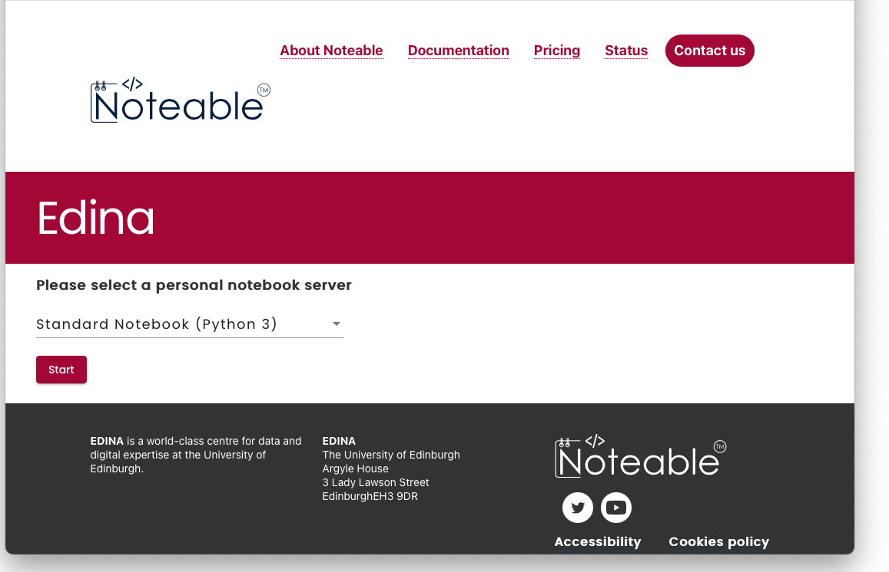

In this first lab we'll show you how to access the noteable server to work on code, how to import code from github to noteable, and then by working through the first notebook you'll learn the basics of python. If that all sounds a bit complicated, don't worry, it's fairly simple and we'll talk you through it step by step here. And if you can't get it to work or have questions, we are available to help you in the drop-in labs on Teams.

# Logging on to noteable

All the coding for this course will be done using interactive Python notebooks, which allow us to combine text and code in a single document. The interactive Python notebooks work using a "Jupyter Server". The University of Edinburgh provides one that you can log into, and we will be accessing it **via Learn**.
To do that:

1. Go to the Simulating Language page on [Learn](http://www.learn.ed.ac.uk/)
2. Click on the 'Content' tab on the top
3. Click on the **Noteable** link at the bottom
4. Once you've logged on to the noteable service you may have to either "reconnect" or "start" your server (if there is a list of options available, stay with "Standard Notebook (Python 3)").
    
5. Once you've started and connected/reconnected to the server you'll be given an interface that will let you upload notebooks and navigate the files you'll be creating.
6. There is a menu labelled `Git`. Click on that and choose `Clone a Repository` enter this web address for the Git Repository URL: `https://github.com/smkirby/simlang2024-25`. You can leave all the other fields at their defaults or blank.
7. Click on `Clone`. This will download all the latest versions of the notebook files onto your noteable account in a folder called `simlang2024-25`. You can navigate to this with the file browser on the left (with the topmost button).

Now that you have a folder of the course files, you're good to go. At the start of the course, the answer files aren't available and these will be made available each week. Because of this you may want to refresh the list of files. To do this, you can use the `Git` menu and select `Pull from Remote`. If you make changes to a file and want to go back to the original, then you can just delete or rename it and then use `Pull from Remote (Force)`, which overrules any changes you've made to the original files.

# Programming tasks for today's lab

You will now see several notebook files (files whose name ends in ".ipynb"). The main part of today's lab is the file [lab1.ipynb](https://github.com/smkirby/simlang2024-25/blob/main/lab1.ipynb) - open that file by clicking on it, it'll open up a new noteable window containing more explanatory text that you can work through. Your main task for labs this week is to work through that notebook! If you need help you can come to drop-in labs on Teams and get one-on-one help.

In addition, here is a notebook explaining what you can use notebooks for:

- [lab1_notebook_intro.ipynb](https://github.com/smkirby/simlang2024-25/blob/main/lab1_notebook_intro.ipynb) is a brief introduction to notebooks, and showcases some of the nice stuff you can do with formatting text etc.

In the week following each lab, we will post the answers to the previous week's labs in the form of a filled-out notebook. We won't do this straight away, to encourage you to try for yourself, so they won't load just now, but check back on Monday!

- [lab1_answered.ipynb](https://github.com/smkirby/simlang2024-25/blob/main/lab1_answered.ipynb) provides a model answer for the lab1 notebook - we have completed the code cells for you so you can see what we were expecting you to do.
- [lab1_walkthrough.ipynb](https://github.com/smkirby/simlang2024-25/blob/main/lab1_walkthrough.ipynb) provides a very detailed explanation of the logic behind the model answers for the "Functions" section of the notebook.

# Re-use

This page was written by Kenny Smith and Simon Kirby, based on https://github.com/smkirby/SimLang/blob/master/README.md, written by Simon Kirby. All aspects of this work are licensed under a [Creative Commons Attribution 4.0 International License](http://creativecommons.org/licenses/by/4.0/).
